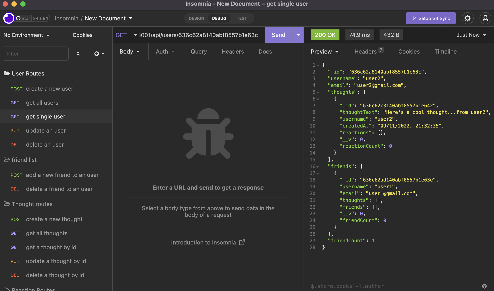

# Social-Media-API

## Description

This project is creating a social media API by user express.js and mongoDB

## Table of Contents

- [Installation](#installation)
- [Usage](#usage)
- [Credits](#credits)
- [License](#license)
- [Tests](#tests)

## Installation

`npm install`

## Usage

1. Use API testing tool (Postman or Insomnia)
   

2. Perform the CRUD operation on user,thought API

you can refer to below video demo:

https://youtu.be/GR-4DvGJLbo

## Credits

BenLiu104 : https://github.com/BenLiu104

## License

License - MIT

## Tests

Use Insomnia to test the API functionality.
